[github.com/vivekstackk](https://github.com/vivekstackk) &nbsp;·&nbsp;
[linkedin](https://www.linkedin.com/in/vivek-damar) &nbsp;·&nbsp;
[leetcode](https://leetcode.com/u/vivekkk44/)

> CS student at National Institute of Technology (NIT) Rourkela. 
> Small, sharp tools over big vague ideas. Build. Learn. Ship. Repeat.

I build modern full-stack web applications, backend systems, and developer tools. 
Focused on clean software architecture, reliable systems, and understanding 
how things work beyond the interface.

<samp>typescript &nbsp; javascript &nbsp; c++ &nbsp; java &nbsp; react &nbsp; node &nbsp; fastify &nbsp; mongodb &nbsp; mysql &nbsp; firebase &nbsp; graphql &nbsp; git &nbsp; linux</samp>

**[seatwise](https://github.com/vivekstackk/seatwisecheck)** &nbsp;·&nbsp; <samp>typescript, react, full-stack</samp> 
Smart seat management and reservation platform. Interactive seat selection, 
reservation workflows, and seamless booking state management.

**[flagwise](https://github.com/vivekstackk/flagwise)** &nbsp;·&nbsp; <samp>typescript, backend, devtools</samp> 
Feature flag and experimentation platform for managing rollouts and 
evaluating variants safely without deploying new releases.

**[job-scheduler](https://github.com/vivekstackk/job-scheduler)** &nbsp;·&nbsp; <samp>typescript, node, fastify</samp> 
Backend job scheduling system for creating, managing, and executing scheduled 
jobs with reliable execution and clean architecture.

**[cinemate](https://github.com/vivekstackk/cinemate)** &nbsp;·&nbsp; <samp>react, javascript, apis</samp> 
Responsive movie discovery application with real-time search, filters, and 
movie information exploration via external APIs.

**[skillswap](https://github.com/vivekstackk/skillswap)** &nbsp;·&nbsp; <samp>react, firebase, full-stack</samp> 
Peer-to-peer skill sharing platform designed to help people discover skills, 
exchange knowledge, and learn from one another.

